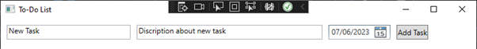

# Unit 16 Assignment 2

## Problem 1

## Design

### Definition statement

To do list

Users can add new tasks to the list by entering a title, description, and due date. The tasks are displayed in a list view, showing the title, description, due date, and completion status of each task. Users can mark tasks as complete or delete tasks from the list.

The application allows users to toggle between displaying all tasks or only incomplete tasks. Users can easily filter the task list to focus on the tasks that are yet to be completed.

When a task is selected from the task list, its details, including the title, description, due date, and completion status, are displayed in a separate section. Users can view the details of each task and mark tasks as complete if they are finished.

Some of the constraints when developing this program will be trying to implement the date and time and producing the dropdown which will be time consuming to create without issues occurring. Another constraint will also be data structuring and how i am going to store the to do lists data. I will be storing the data using an empty list to store tasks.

Complexity in the program should be efficient enough with no addition involved, but could require some filtering within the program for the tasks like the completed task and incomplete task function. It should be efficient by execution standards as it is only a small program and I will try to aim towards simple code and I will try not to include irrelevant code blocks in the program.

Key Features:

* Add Task - Users can add new tasks to the list by entering a title, description, and due date.

* Mark as Complete - Users can mark tasks as complete, indicating that they have been finished.

* Delete Task - Users can delete tasks from the list if they are no longer needed.

* Task Filtering - Users can toggle between displaying all tasks or only incomplete tasks.

* Task Details - The application provides a task details section that displays the title, description, due date, and completion status of the selected task.

### Data dictionary

In my program I will include some data structures for various variables that I will implement in my program code. The data structures i will include are:

TaskItem Class: - Represents a single task item in the to-do list and represents additional details or description of the given task or tasks.

List<TaskItem>: - A collection that stores the task items and all task items that are added by the user are stored in this list.

Event Handlers:

* AddTaskButton_Click: Handles the click event when the user clicks the "Add Task" button to add a new task to the list.

* ToggleTasksButton_Click: Handles the click event when the user clicks the "Show Incomplete Tasks" button to toggle between displaying all tasks or only incomplete tasks.

* TaskListView_SelectionChanged: Handles the selection changed event when the user selects a task from the task list.

* DeleteTaskButton_Click: Handles the click event when the user clicks the "Delete Task" button to delete the selected task.

* CompleteTaskButton_Click: Handles the click event when the user clicks the "Complete Task" button to mark the selected task as complete.

### Flowchart

I have created a mermaid flowchart to help plan my program to make it easier to write when I am implementing my code.

### Pseudocode

This is the pseudocode I have produced to represent how I am going to structure my C# code. I have included how I am going to add tasks, complete tasks and show the incomplete tasks in the program and planned how I am going to structure each class in the program.

~~~ Pseudocode

  

class Task { 

    string Title 

    string Description 

    DateTime DueDate 

} 

  

List<Task> tasks 

  

function AddTask() { 

    string title = ReadInput("Enter task title") 

    string description = ReadInput("Enter task description") 

    DateTime dueDate = ReadDateInput("Enter task due date") 

  

    if (title is empty or dueDate is not provided) { 

        ShowErrorMessage("Please enter a title and due date.") 

        return 

    } 

  

    Task newTask = new Task() 

    newTask.Title = title 

    newTask.Description = description 

    newTask.DueDate = dueDate 

    newTask.Completed = false 

  

    tasks.Add(newTask) 

  

    UpdateTaskListDisplay() 

} 

  

function UpdateTaskListDisplay() { 

    for each task in tasks { 

        if (showIncompleteOnly and task.Completed) { 

            continue 

        } 

  

    } 

} 

  

function CompleteTask(task) { 

    task.Completed = true 

    UpdateTaskListDisplay() 

} 

  

function ToggleShowIncompleteOnly() { 

    UpdateTaskListDisplay() 

} 

  

function Main() { 

  

    while (true) { 

  

        if (AddTaskButtonClicked) { 

            AddTask() 

        } 

  

        if (CompleteTaskButtonClicked) { 

            CompleteTask(selectedTask) 

        } 

  

        if (ShowIncompleteOnlyCheckboxToggled) { 

            ToggleShowIncompleteOnly() 

        } 

    } 

} 

  

~~~

### UI designs

I have used a software called figma to come up with two UI designs that I will chose to implement in my final program.

Design 1 I thought looked nice with the task name and description vertically aligned with one another however, I don't like the spacing on the right hand side too much but to counter that i could make the form appear smaller but id much prefer a larger form for visual purposes.

Design 2 is a significantly different design to the first with different colours and layouts. This design has the taskname, description, date and new task all horizontally at the top of the page. The completed and incomplete task boxes at the bottom are relatively similar just with more detailed information on the task done.

## Implementation

Firstly, I will create a C# WPF application and I will start to implement the design I have chosen to implement for the user interface. For my program I am going to base the UI on design 2 and I will start to implement the xaml code into my program.

Here is the XAML code which produces the following design when the program is ran:

~~~ XML

    <Grid> 

        <Grid.RowDefinitions> 

            <RowDefinition Height="Auto"/> 

            <RowDefinition Height="*"/> 

        </Grid.RowDefinitions> 

  

        <StackPanel Orientation="Horizontal" Margin="10"> 

            <TextBox x:Name="txtTitle" Width="200" Margin="0 0 10 0" /> 

            <TextBox x:Name="txtDescription" Width="300" Margin="0 0 10 0" /> 

            <DatePicker x:Name="dpDueDate" Width="100" Margin="0 0 10 0" /> 

            <Button Content="Add Task" Click="AddTask_Click"/> 

        </StackPanel> 

  

        <ListView x:Name="lstTasks" Grid.Row="1" Margin="10" ItemsSource="{Binding Tasks}"> 

            <ListView.View> 

                <GridView> 

                    <GridViewColumn Header="Title" DisplayMemberBinding="{Binding Title}"/> 

                    <GridViewColumn Header="Description" DisplayMemberBinding="{Binding Description}"/> 

                    <GridViewColumn Header="Due Date" DisplayMemberBinding="{Binding DueDate}"/> 

                    <GridViewColumn Header="Completed" DisplayMemberBinding="{Binding Completed}"/> 

                    <GridViewColumn Header="Actions"> 

                        <GridViewColumn.CellTemplate> 

                            <DataTemplate> 

                                <Button Content="Complete" Click="CompleteTask_Click"/> 

                            </DataTemplate> 

                        </GridViewColumn.CellTemplate> 

                    </GridViewColumn> 

                </GridView> 

            </ListView.View> 

        </ListView> 

  

        <CheckBox x:Name="chkShowIncomplete" Grid.Row="1" Margin="10,186,10,10" Content="Show Incomplete" Checked="ShowIncomplete_Checked" Unchecked="ShowIncomplete_Unchecked"/> 

    </Grid> 

</Window> 

~~~

I have used a grid based layout to organize the UI elements in rows and columns. I have also included two rows defined using Grid.RowDefinitions, one with Auto height for the input section and the other with * height for the task list section. In the input section (The stackpanel) i have used a horizontal StackPanel which is used to group input elements for adding new tasks. I have used textBoxes for the task title and description, a DatePicker for the due date, and a Button to add the task. I have implemented a ListView control is used to display the list of tasks. The ListView uses a GridView to define the columns for displaying task properties (Title, Description, Due Date, Completed). The ListView also uses a GridView to define the columns for displaying task properties (Title, Description, Due Date, Completed). I have implemented a Checkbox control to provide the task list which is to toggle the display of incomplete tasks. I have included an event handler for the Checked and Unchecked events ("ShowIncomplete_Checked" and "ShowIncomplete_Unchecked").

Now that the UI design is implemented, i will start implementing the code in the .cs file.

This is the finished and completed code:

~~~ C#

  

using System; 

using System.Collections.Generic; 

using System.ComponentModel; 

using System.Windows; 

using System.Windows.Controls; 

  

namespace ToDoList 

{ 

    public partial class MainWindow : Window, INotifyPropertyChanged 

    { 

        private List<Task> tasks; 

        private bool showIncompleteOnly; 

  

        public List<Task> Tasks 

        { 

            get 

            { 

                if (showIncompleteOnly) 

                    return tasks.FindAll(task => !task.Completed); 

                else 

                    return tasks; 

            } 

        } 

        private void CompleteTask_Click(object sender, RoutedEventArgs e) 

        { 

            Button button = (Button)sender; 

            Task task = button.DataContext as Task; 

  

            if (task != null) 

            { 

                task.Completed = true; 

                PropertyChanged?.Invoke(this, new PropertyChangedEventArgs("Tasks")); 

            } 

        } 

  

        public event PropertyChangedEventHandler PropertyChanged; 

  

        public MainWindow() 

        { 

            InitializeComponent(); 

            tasks = new List<Task>(); 

            showIncompleteOnly = false; 

            DataContext = this; 

        } 

  

        private void AddTask_Click(object sender, RoutedEventArgs e) 

        { 

            string title = txtTitle.Text; 

            string description = txtDescription.Text; 

            DateTime? dueDate = dpDueDate.SelectedDate; 

  

            if (!string.IsNullOrEmpty(title) && dueDate.HasValue) 

            { 

                Task newTask = new Task(title, description, dueDate.Value); 

                tasks.Add(newTask); 

                PropertyChanged?.Invoke(this, new PropertyChangedEventArgs("Tasks")); 

                ResetInputs(); 

            } 

            else 

            { 

                MessageBox.Show("Please enter title and due date."); 

            } 

        } 

  

        private void ResetInputs() 

        { 

            txtTitle.Text = string.Empty; 

            txtDescription.Text = string.Empty; 

            dpDueDate.SelectedDate = null; 

        } 

  

        private void ShowIncomplete_Checked(object sender, RoutedEventArgs e) 

        { 

            showIncompleteOnly = true; 

            PropertyChanged?.Invoke(this, new PropertyChangedEventArgs("Tasks")); 

        } 

  

        private void ShowIncomplete_Unchecked(object sender, RoutedEventArgs e) 

        { 

            showIncompleteOnly = false; 

            PropertyChanged?.Invoke(this, new PropertyChangedEventArgs("Tasks")); 

        } 

    } 

  

    public class Task 

    { 

        public string Title { get; set; } 

        public string Description { get; set; } 

        public DateTime DueDate { get; set; } 

        public bool Completed { get; set; } 

  

        public Task(string title, string description, DateTime dueDate) 

        { 

            Title = title; 

            Description = description; 

            DueDate = dueDate; 

            Completed = false; 

        } 

    } 

} 

  

~~~

The MainWindow class inherits from the window class which is located in the XAML file. It also implements the  INotifyPropertyChanged interface for data binding support. The private fields tasks which is List<Task> and the showIncompleteOnly boolean is used for managing the task list and the display filter. The program defines the public property Tasks and returns the filtered list of tasks based on the showIncompleteOnly flag. The program uses the FindAll() method to filter the list of tasks. The program also defines the event handler CompleteTask_Click for marking a task as completed. It then sets the Completed property of the task to true and raises the PropertyChanged event to update the task list display. I have implemented the PropertyChanged event and make it to set the tasks property to filter flag changes. The MainWindow constructor was implemented to initialize the tasks list and to set the showIncompleteOnly flag to false. The AddTask_Click event handler handles the click event of the Add task button. The Add task button retrives the input values title, description and due date from the text boxes and date picker. The AddTask_Click event handler also creates a new task object with the provided values and adds it to the tasks list. The event handler also raises the PropertyChanged event to update the task list display and to reset the input fields. I have implemented a message box if the title or due date is not entered as the description is optional. I have implemented a Reset Inputs method to clear the text in the title and description text boxes for the next input and the method also resets the date picker. The ShowIncomplete_Checked event handler handles the checked events of the Show incomplete only checkbox and it sets the showIncompleteOnly flag to true and raises the PropertyChanged event to update the task list display. The final event handler is the ShowIncomplete_Unchecked event handler, which handles the unchecked event of the Show complete only checkbox and sets the showIncompleteOnly flag to false and raises the PropertyChanged event to update the task list display. The task class at the end of the program represents a single task with properties for the title, description, due date and the completion status. Overall, my program provides the correct functionality for adding the tasks, tracking the tasks by marking them as completed and filtering the different tasks based on if they are completed or not.

## Test Plan

This is my test plan for my to do list. Firstly i am going to test the program to see if it can add a task sucessfully. To test that i will enter valid values for title, description, and due date. I will then click the add task button, which should appear in the task list below. I will then test adding a task with a missing title or a missing due date. I will test this by entering a valid description and an invalid title or due date. I will then click the add task button which should verify that a message box is displayed indicating the missing title or due date. After them tests become sucessful I will test completing a task. To test this feature I will click the complete button on a task in the task list. By hitting the complete button the task list should verify that the task is complete. To test the filtering of incomplete tasks I will test the show incomplete only checkbox to verify that when checked, only incomplete tasks are listed in the checkbox. This should also verify that the completed taskes are not shown. The final test i will run is clearing the chow incomplete only filter. To test that feature i will uncheck the show incomplete only checkbox which should clear the filters back to normal and show the incomplete tasks only.

## Testing

Following my test plan, I am now going to be testing my program based on its functionality and useability.

The first aspect I will test within my program is adding my task successfully. The first image is me filling in the fields for the task otherwise the program will throw an error, which I will test next. The second image shows the task being added as an incomplete task and the task will be shown when the incomplete box is ticked.

If i select add task without filling in either the title or description fields the program will throw an error.

The next task I will carry out is clicking the complete task button on the active task. Below I have clicked that button and the task has moved from the main panel to the show ncomplete pannel. If the show incomplete panel was ticked it would not show the task, but as it is not ticked it shows the task because it is completed.

As the show incomplete box is checked, it shows no tasks because the task is marked as complete.

## Problem 2

## design

For the design of my program I am going to start with making a class diagram which will show me what classes, methods and objects I should be using in my program. As shown below I have produced a class diagram which has my main program with my main() class and my variable types like my strings and integers. The class diagram just gives me a small indication of what sort of structure I should use in the program.

### flowchart

### pseudocode

To plan for this problem, I am going to produce some pseudocode which will allow me to logically think about how I am going to set out this program and what methods, classes and objects I need to use.

Here is the pseudocode I have produced.

~~~ Pseudocode

  

CONSTANT FILENAME = "books.csv" 

DECLARE dictionary books 

  

PROCEDURE main() 

    books = emptyDictionary 

  

    OPEN FILENAME for reading 

    IF FILENAME does not exist THEN 

        DISPLAY "Error: File not found" 

        EXIT program 

    END IF 

  

    READ line FROM FILENAME  // Skip header row 

  

    DECLARE randomNumberGenerator 

    DECLARE set generatedNumbers 

    generatedNumbers = emptySet 

  

    WHILE NOT endOfFile(FILENAME) DO 

        line = READ line FROM FILENAME 

        publisher = SPLIT line BY delimiter  // Extract publisher 

  

        REPEAT 

            randomNumber = generateRandomNumber() 

        UNTIL NOT generatedNumbers CONTAINS randomNumber 

        generatedNumbers.add(randomNumber) 

  

        books.add(randomNumber, publisher) 

    END WHILE 

  

    CLOSE FILENAME 

  

    FOR EACH entry IN books DO 

        PRINT entry.key, entry.value 

    END FOR EACH 

END PROCEDURE 

  

FUNCTION generateRandomNumber() : integer 

    Generate a random number with multiple digits 

    Implementation specific to the programming language 

END FUNCTION 

  

~~~

### implementation

This problem is a much bigger task and has taken some time to come up with some sort of solution for the problem. At the minute, the solution meets most of the current requirements, but I will implement all the clients requirements once I have reviewed my code. This is the current program.

~~~ C#

using System; 

using System.Collections.Generic; 

using System.IO; 

  

class Program 

{ 

    static void Main() 

    { 

        string filename = "books.csv"; 

  

        // Dictionary to store book number and publisher 

        Dictionary<int, string> books = new Dictionary<int, string>(); 

  

        // Read the CSV file 

        using (StreamReader reader = new StreamReader(filename)) 

        { 

            reader.ReadLine(); // Skip the header 

  

            int bookNumber = 1; 

  

            // Extract the publisher 

            string line; 

            while ((line = reader.ReadLine()) != null) 

            { 

                string[] row = line.Split(','); 

                string publisher = row[4];  

                books.Add(bookNumber, publisher); 

                bookNumber++; 

            } 

        } 

  

        // Print the book number and publisher 

        foreach (KeyValuePair<int, string> book in books) 

        { 

            Console.WriteLine("Book Number: {0}, Publisher: {1}", book.Key, book.Value); 

        } 

    } 

} 

  

~~~

Below is my updated code, which I have replaced the integer book number which was not a unique number with a string type to support multiple and random digits. The HashSet named generatedNumbers is used to keep track of the generated numbers and ensure uniqueness. The GenerateRandomNumber function generates a random 4-digit number as a string.

~~~ C#

  

using System; 

using System.Collections.Generic; 

using System.IO; 

  

class Program 

{ 

    static void Main() 

    { 

        string filename = "books.csv"; 

  

        // Dictionary to store book number and publisher 

        Dictionary<string, string> books = new Dictionary<string, string>(); 

  

        // Read the CSV file 

        using (StreamReader reader = new StreamReader(filename)) 

        { 

            reader.ReadLine();  

  

            // Extract the publisher 

            string line; 

            Random random = new Random(); 

            HashSet<string> generatedNumbers = new HashSet<string>(); 

  

            while ((line = reader.ReadLine()) != null) 

            { 

                string[] row = line.Split(','); 

                string publisher = row[3];  

                string randomNumber; 

                do 

                { 

                    randomNumber = GenerateRandomNumber(random); 

                } 

                while (generatedNumbers.Contains(randomNumber)); 

  

                generatedNumbers.Add(randomNumber); 

                books.Add(randomNumber, publisher); 

            } 

        } 

  

        // Print the book number and publisher 

        foreach (KeyValuePair<string, string> book in books) 

        { 

            Console.WriteLine("Book Number: {0}, Publisher: {1}", book.Key, book.Value); 

        } 

    } 

  

    static string GenerateRandomNumber(Random random) 

    { 

        return random.Next(1000, 10000).ToString(); 

    } 

} 

  

~~~

I feel like my code is a good program to grow and expand upon, as it achieves the task of reading a CSV file, extracting the publisher information, generating unique random numbers, and storing them in a dictionary. However, I could make the code much better for its function as i wanted the code to output the numbers onto a separate csv file but i struggled to find a solution, so i used a dictionary to store the unique hash numbers. I have used encapsulation in my program by using a dictionary to store book numbers and publishers as it encapsulates related data together.

## Test plan

This is my test plan for the libary index program and my test will include:

Test Reading Input File:

I will provide a valid input CSV file with book details. I will then verify that the program reads the file successfully without any errors To ensure that the number of lines read matches the expected number of books. 
Test Generating Index Reference
I will manually create a test case with specific book details (author and title). I will then run the program and verify that the generated index reference is correct. Repeat the test with different book details to ensure the index reference is unique.

Test Indexing Books

I will provide a valid input CSV file with book details. I will then run the program and verify that the indexed books are generated without any errors. Then i will check the indexed books list and ensure that it contains the correct number of books. Verify that each book in the list has the expected index reference.
